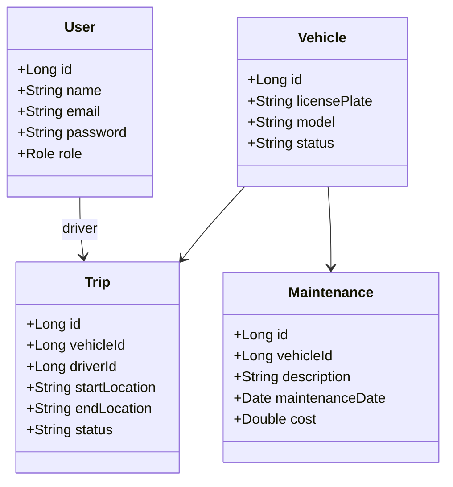

# 🚚 Fleet & Logistics Management System - Backend (Stage 1)

This is the Stage 1 implementation of the **Fleet & Logistics Management System**, built with **Spring Boot**. It includes secure JWT authentication, modular REST APIs, database integration using JPA, and interactive Swagger documentation.

---

## 📁 Folder Structure

```
fleet-management-backend/
├── src/
│   ├── main/
│   │   ├── java/com/fleetmanagement/
│   │   │   ├── controller/         # REST Controllers
│   │   │   ├── service/            # Business Logic Services
│   │   │   ├── repository/         # Spring Data JPA Repositories
│   │   │   ├── model/              # Entity Definitions
│   │   │   ├── config/             # Security and Swagger Configs
│   │   │   ├── dto/                # Data Transfer Objects
│   │   │   └── FleetManagementApplication.java
│   │   └── resources/
│   │       └── application.properties
└── pom.xml
```

---

## 🔐 Authentication & Authorization

### Features:
- **Register** new users (Admin, Fleet Manager, Driver)
- **Login** to receive JWT token
- **JWT Auth** protected endpoints
- **Role-Based Access Control**

### Endpoints:
| Method | Endpoint             | Description                   | Role Required |
|--------|----------------------|-------------------------------|----------------|
| POST   | /api/auth/register   | Register new user             | ❌ Public |
| POST   | /api/auth/login      | Login and get JWT token       | ❌ Public |

---

## 🚗 Vehicle Module

### Features:
- Add, update, list, view vehicles
- Track vehicle status

### Endpoints:
| Method | Endpoint             | Description                   | Role Required |
|--------|----------------------|-------------------------------|----------------|
| POST   | /api/vehicles        | Add new vehicle               | ADMIN, FLEET_MANAGER |
| GET    | /api/vehicles        | Get all vehicles              | ALL ROLES |
| GET    | /api/vehicles/{id}   | Get vehicle by ID             | ALL ROLES |
| PUT    | /api/vehicles/{id}   | Update vehicle                | ADMIN, FLEET_MANAGER |

---

## 📦 Trip Module

### Features:
- Create trips
- Assign drivers and vehicles
- Track trip status

### Endpoints:
| Method | Endpoint             | Description                   | Role Required |
|--------|----------------------|-------------------------------|----------------|
| POST   | /api/trips           | Create new trip               | FLEET_MANAGER, ADMIN |
| GET    | /api/trips           | Get all trips                 | ALL ROLES |
| GET    | /api/trips/driver/{id} | Get trips for a driver       | FLEET_MANAGER, ADMIN, DRIVER |
| GET    | /api/trips/vehicle/{id} | Get trips for a vehicle     | FLEET_MANAGER, ADMIN |

---

## 🛠️ Maintenance Module

### Features:
- Log maintenance activities
- Track maintenance cost and history

### Endpoints:
| Method | Endpoint                   | Description                   | Role Required |
|--------|----------------------------|-------------------------------|----------------|
| POST   | /api/maintenance           | Add new maintenance log       | FLEET_MANAGER, ADMIN |
| GET    | /api/maintenance           | Get all maintenance records   | ALL ROLES |
| GET    | /api/maintenance/vehicle/{id} | Get maintenance by vehicle | ALL ROLES |

---

## 🔐 Security Stack

- Spring Security with JWT (Stateless)
- Role-based endpoint access
- BCrypt password hashing

---

## 📄 API Documentation

> Swagger UI available at:

```
http://localhost:8080/swagger-ui/index.html
```

You can test all endpoints interactively, authorize with your JWT token, and inspect request/response payloads.

---

## 💾 Tech Stack

| Layer             | Technology         |
|------------------|--------------------|
| Language          | Java 17+           |
| Framework         | Spring Boot        |
| ORM               | Spring Data JPA    |
| Database          | PostgreSQL / MySQL |
| Security          | Spring Security + JWT |
| Docs              | Swagger OpenAPI 3  |
| Build Tool        | Maven / Gradle     |

---

## 📌 How to Run

1. Clone the project:
```
git clone https://github.com/your-repo/fleet-management-backend.git
```

2. Configure `application.properties` with your database settings.

3. Build and run:
```
./mvnw spring-boot:run
```

4. Access Swagger UI and begin testing.

---

## 📐 UML Overview (High-Level)



---

## 🧪 Postman Collection

You can find a full working Postman collection with:
- 7 sample users
- 7 vehicles
- 7 trips
- 7 maintenance logs

🔗 Import: `fleet-management.postman_collection.json`

---

## 📬 Contact

> Need help or want to contribute? Reach out!

---

**© 2025 Fleet Management System — Stage 1 Complete 🚀**
